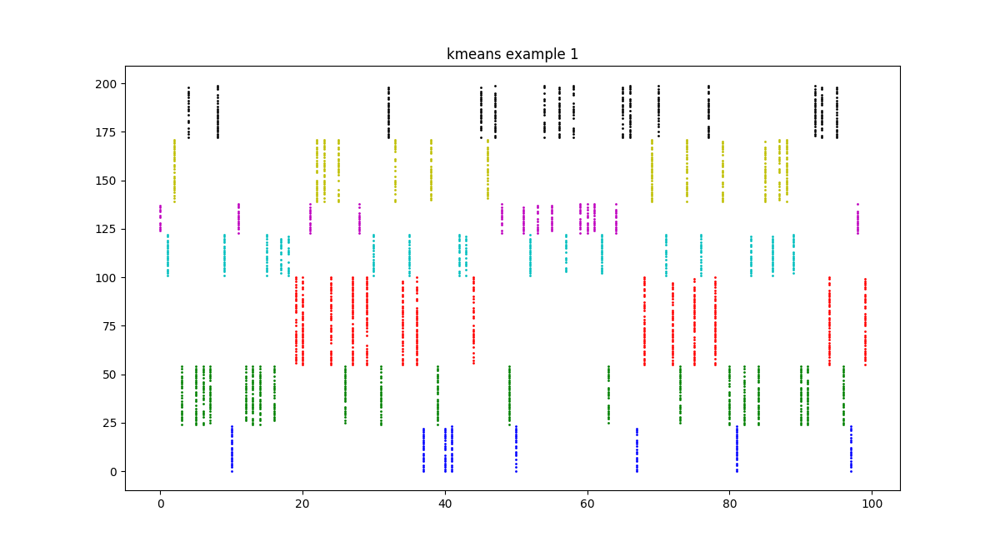
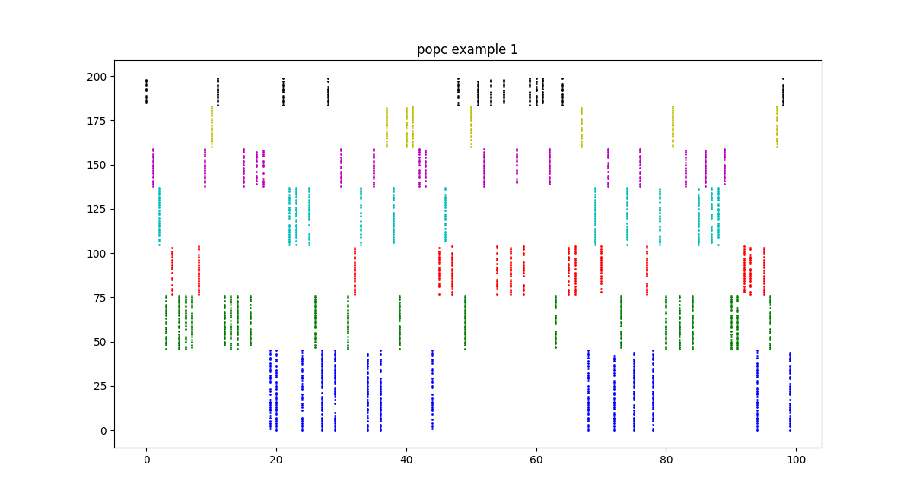
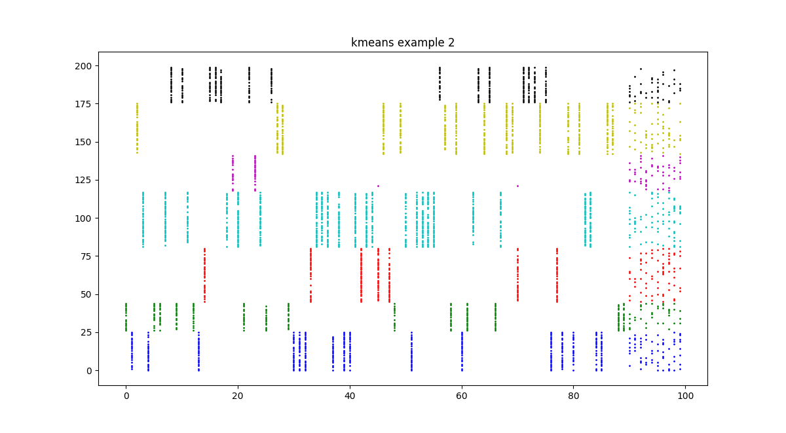
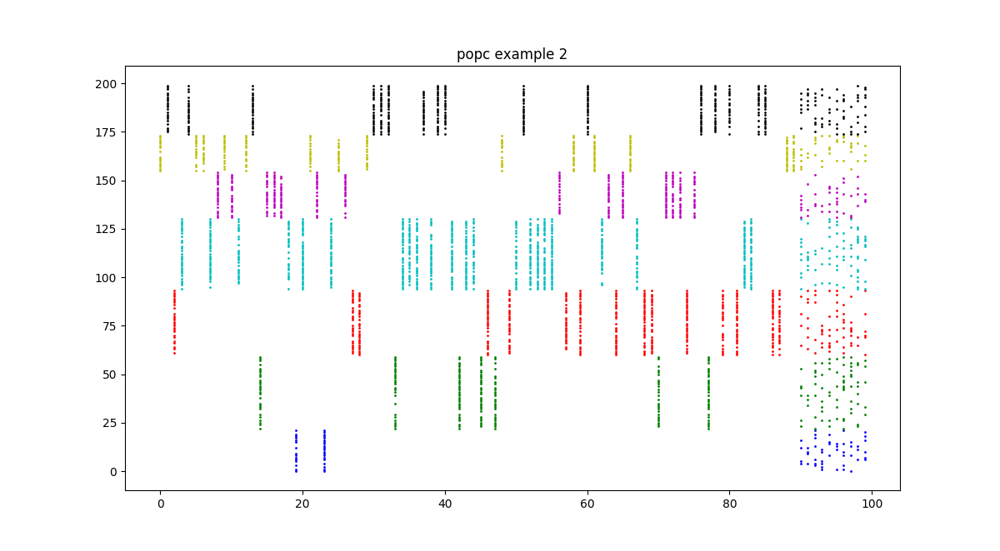
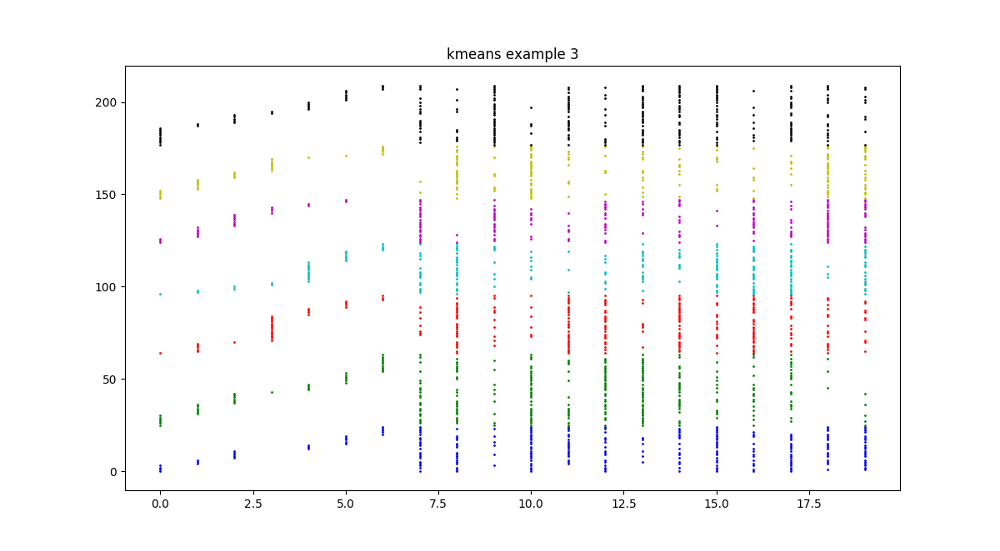
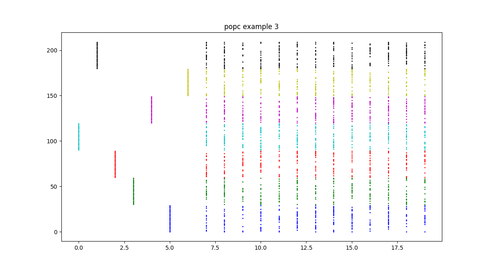

# Powered Outer Probabilistic Clustering

References:
* P. Taraba: [Powered Outer Probabilistic Clustering](http://www.iaeng.org/publication/WCECS2017/WCECS2017_pp394-398.pdf), Proceedings of the World Congress on Engineering and Computer Science, IAENG, October 2017 [[best paper award](http://www.iaeng.org/WCECS2017/awards.html)]
* P. Taraba: [Clustering for binary featured datasets](https://link.springer.com/chapter/10.1007/978-981-13-2191-7_10), [Transactions on Engineering Technologies: WCECS 2017](https://www.springer.com/us/book/9789811321900), Springer, 2019
* D.J. Brunner, P. Taraba, A. Ankolekar: [Personal data fusion](https://patents.google.com/patent/US11017343B2/en), US11017343B2, 2018, 2021

